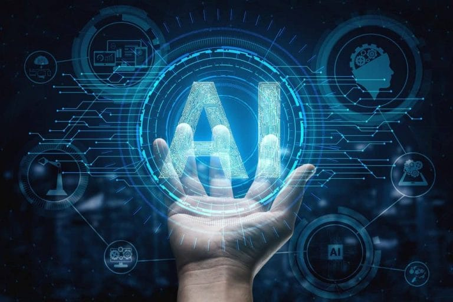

  <h1> Artificial Intelligence </h1>

  

### Table of Contents

- [Overview in 2026](#overview-in-2026)

## Overview in 2026

- **Developers:** AI is now used by **84% of developers**.
- **Code:** **41% of code** is generated by AI.
- **Trust:** **36% of AI-generated code** is trusted without human review.
- **Education:** AI enables us to learn faster and start building real projects from day one.
- **Development:** The role of a developer has shifted from writing code to orchestrating it, the real value now lies in making decisions, reviewing outputs, and solving problems, not just writing syntax.
- **Employment:** Job postings no longer ask you to know how to code, they expect you to combine strong programming fundamentals with AI.
- **Future:** You won't be replaced by AI, you'll be replaced by someone who knows how to use AI better than you.

### Key points

- **Software Creation:** Creating software is no longer the same as programming.
- **Fundamentals:** Programming fundamentals are more important than ever.
- **Leadership:** You direct; AI executes.
- **AI Adoption:** Using AI is no longer optional, it's a core skill.